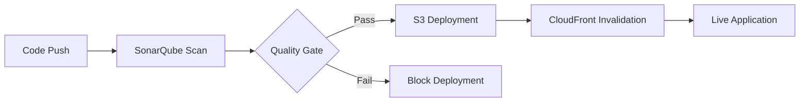

# S3 Web Application Deployment


## Overview

Enterprise-grade DevOps pipeline for deploying static web applications to AWS infrastructure with automated quality gates, security scanning, and global content distribution.

## Architecture

### Infrastructure Components
- **AWS S3** - Static website hosting with versioning and lifecycle policies
- **AWS CloudFront** - Global CDN with edge caching and SSL termination
- **GitHub Actions** - CI/CD orchestration with matrix builds and parallel execution
- **SonarQube** - Static code analysis with quality gates and security vulnerability detection

### DevOps Pipeline



## Pipeline Stages

### 1. Code Quality Analysis
- **Static Code Analysis** - SonarQube scans for bugs, vulnerabilities, and code smells
- **Security Scanning** - OWASP Top 10 vulnerability detection
- **Quality Gates** - Enforced quality thresholds block poor code from deployment

### 2. Deployment Automation
- **Intelligent Sync** - Only changed files are uploaded to S3
- **File Exclusions** - Development files and documentation excluded from production
- **Atomic Deployments** - All-or-nothing deployment strategy

### 3. Cache Management
- **Global Invalidation** - CloudFront cache cleared across all edge locations
- **Zero-Downtime** - Users always see the latest version without service interruption

## Configuration

### Required GitHub Secrets
```bash
# AWS Credentials
AWS_ACCESS_KEY_ID=<your-access-key>
AWS_SECRET_ACCESS_KEY=<your-secret-key>
AWS_REGION=<your-region>

# Infrastructure Resources
S3_BUCKET_NAME=<your-s3-bucket>
CLOUDFRONT_DISTRIBUTION_ID=<your-distribution-id>

# Code Quality
SONAR_TOKEN=<your-sonar-token>
```

### Deployment Triggers
- **Push to main** - Automatic deployment when web assets change
  - HTML files (`**.html`)
  - Stylesheets (`**.css`)
  - JavaScript (`**.js`)
  - Images (`images/**`)
  - Fonts (`fonts/**`)
- **Pull Requests** - Quality validation before merge
- **Manual Dispatch** - On-demand deployments for hotfixes

## Project Structure
```
s3-webapp-deployment/
├── .github/workflows/
│   └── s3-deploy.yaml          # CI/CD pipeline definition
├── css/                        # Stylesheets
├── js/                         # JavaScript files
├── images/                     # Static assets
├── fonts/                      # Web fonts
├── index.html                  # Main application entry
└── README.md                   # Documentation
```

## DevOps Best Practices

### Security
- IAM roles with least privilege access
- Secrets management via GitHub encrypted secrets
- HTTPS-only content delivery via CloudFront

### Reliability
- Multi-region CDN distribution
- Automated rollback capabilities
- Health checks and monitoring

### Performance
- Global edge caching
- Gzip compression
- Optimized asset delivery

### Monitoring
- CloudWatch metrics integration
- Deployment status notifications
- Performance tracking

## Getting Started

1. **Fork Repository** - Create your own copy
2. **Configure Secrets** - Add required GitHub secrets
3. **Update Content** - Modify web application files
4. **Push Changes** - Automatic deployment triggers

## Troubleshooting

### Common Issues
- **Deployment Fails**: Check AWS credentials and permissions
- **SonarQube Fails**: Verify SONAR_TOKEN is valid
- **Cache Issues**: Manual CloudFront invalidation may be needed

### Monitoring
- GitHub Actions logs for pipeline execution
- AWS CloudWatch for infrastructure metrics
- SonarQube dashboard for code quality trends